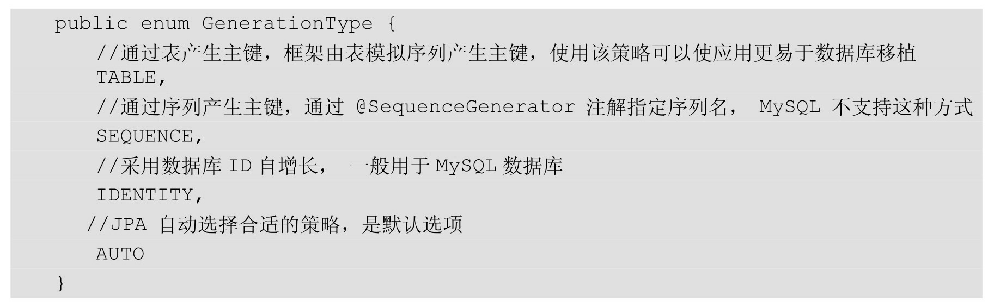

#Spring Data JPA 简单使用介绍

## 重要的几个接口
- **Repository**
- **CrudRepository**
- **PagingAndSortingRepository**
- **QueryByExampleExecutor**
- **JpaRepository**

看UML图

## 定义查询方法
save  
update  
delete  
find...By   
read...By  
query...By  
count...By  
get...By  

命名参数 @Param

## 注解式查询方法
@NamedQuery 预定义查询（不常用）
- findById1
@Query 
- JPQL 语句
- 原生SQL 语句

## 查询结果及扩展

T

Page<T>

Projections映射方式 `ArticleTitleAuthor`
- findById

DTO方式 `ArticleTitleAuthorDTO`
- findOneById
- findAllBy

## 分页相关类

Pageable  
Sort  
Order  
Page<T>  

## @Entity实例相关注解

- @Entity  
 定义对象将会成 为被JPA管理的实体，将映射到指定的数据库表。
 
- @Table   
  指定数据库的表名。
- @Id  
  定义属性为数据库的主键，一个实体里面必须有一个。
- @IdClass  
  利用外部类的联合主键。
  
> 作为符合主键类，要满足以下几点要求。  
  必须实现Serializable接口。  
  必须有默认的public无参数的构造方法。    
  必须覆盖equals和hashCode方法。equals方法用于判断两个对象是否相同，EntityManger通过find方法来查找Entity时是根据equals的返回值来判断的。在本例中，只有对象的name和email值完全相同或同一个对象时才返回true，否则返回false。hashCode方法返回当前对象的哈希码，生成的hashCode相同的概率越小越好，算法可以进行优化。
  　　
- @GeneratedValue  
为主键生成策略  

- @Basic  
表示属性是到数据库表的字段的映射。如果实体的字段上
没有任何注解，默认即为@Basic。
- @Transient  
表示该属性并非一个到数据库表的字段的映射，表示
非持久化属性，与@Basic作用相反。JPA映射数据库的时候忽略它。  
- @Column  
定义该属性对应数据库中的列名。
- @Temporal  
用来设置Date类型的属性映射到对应精度的字段。  
（1）@Temporal(TemporalType.DATE)映射为日期∥date（只有
日期）。  
（2）@Temporal(TemporalType.TIME)映射为日期∥time（只有
时间）。  
（3）@Temporal(TemporalType.TIMESTAMP)映射为日期∥date
time（日期+时间）。  

- @Enumerated  
直接映射enum枚举类型的字段。
- @Lob  
 将属性映射成数据库支持的大对象类型，支持以下两种数据库类型的字段。   
 （1）Clob（Character Large Ojects）类型是长字符串类型，java.sql.Clob、Character[]、char[]和String将被映射为Clob类
 型。  
 （2）Blob（Binary  Large  Objects）类型是字节类型，java.sql.Blob、Byte[]、byte[]和实现了Serializable接口的类型将被映射为Blob类型。  
 （3）Clob、Blob占用内存空间较大，一般配合@Basic(fetch=FetchType.LAZY)将其设置为延迟加载。  

## 剩余的关联关系的注解留给自行探索
包括@JoinColumn、@OneToOne、@OneToMany、
@ManyToOne、@ManyToMany、@JoinTable、@OrderBy

## 高级部分略

